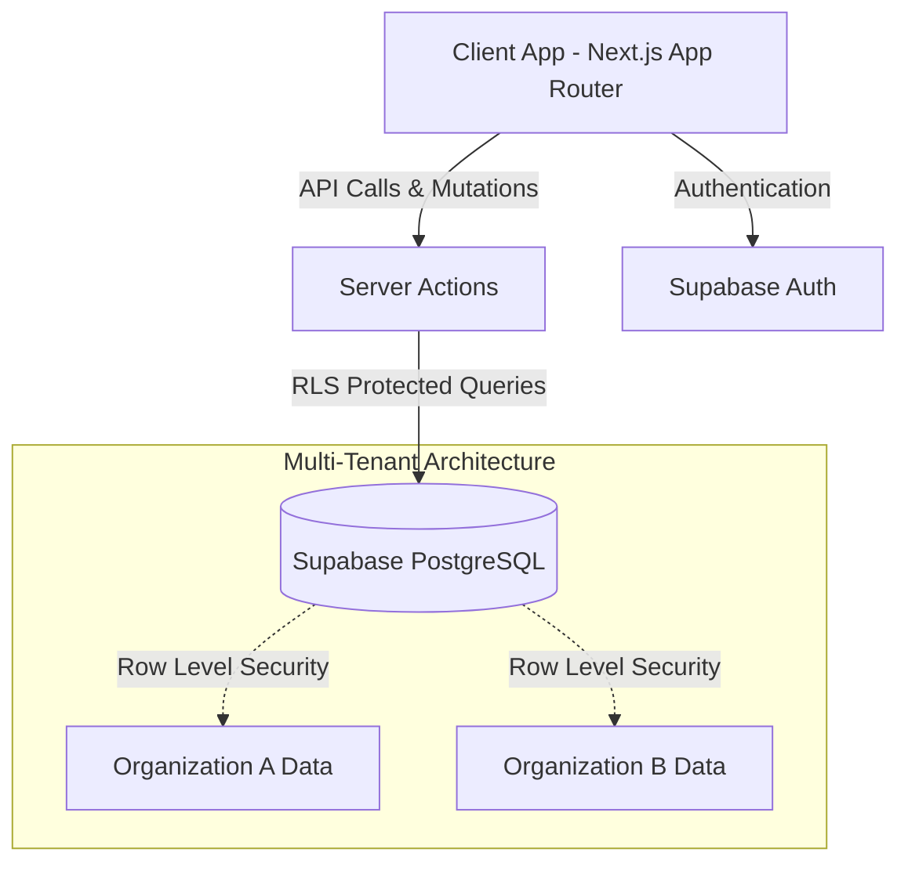
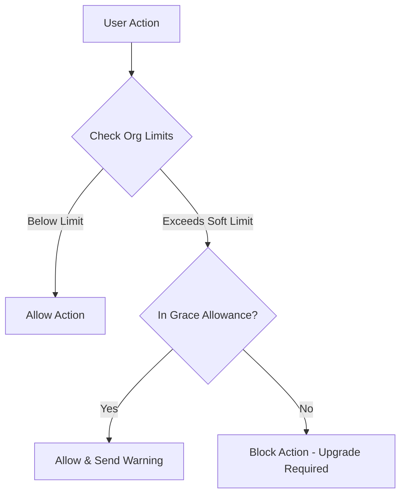

# TramiFlow CRM

<div align="center">
  <p><strong>Open Core SaaS CRM for Immigration Procedures & Workflows</strong></p>
  <a href="https://tramiflow-demo.vercel.app"><strong>🔴 Live Demo</strong></a> | 
  <a href="#-core-vs-pro"><strong>Core vs PRO</strong></a> | 
  <a href="#-self-hosting-with-docker"><strong>Self-Hosting</strong></a>
</div>

<br/>


TramiFlow is a robust, multi-tenant CRM built with Next.js 14, Supabase (PostgreSQL + RLS), Shadcn/UI, and Tailwind CSS. It features dynamic Kanban boards, a visual Template Builder, and a powerful client-side PDF optimization kit.

## 📸 Screenshots

| Enterprise Dashboard | Client & Document Management |
| :---: | :---: |
|  |  |

| Procedure Template Builder | Secure Google Access |
| :---: | :---: |
|  |  |

---

## 🏗️ Architecture



### Advanced Hard & Soft Limits Architecture

Our Server Actions intercept resource consumption and enforce Grace Allowances for subscription limits:



## 🔐 Security Audit & RLS

TramiFlow adheres to strict SaaS security standards. A comprehensive internal security audit was completed ensuring:
- **Strict Row-Level Security (RLS)**: All tables are fortified. Queries without an `organization_id` context will fail or return no data.
- **Private Storage**: All document buckets (`client-docs`) are strictly private and utilize signed URLs.
- **Server-Side Enforcement**: Limits, billing, and structural data are verified server-side, never trusting the client state.

## 🤖 AI-Assisted Development Workflow

TramiFlow uses the **JARVIS Protocol**, an AI-assisted Pull Request workflow that handles atomic commits, multi-tenancy verification, and automated PR generation. See [CONTRIBUTING.md](./CONTRIBUTING.md) for details on how we orchestrate AI agents for code delivery.

---

## 💎 Core vs PRO

TramiFlow operates on an Open Core model. See [OPEN_CORE.md](./OPEN_CORE.md) for details.

| Module | Community Edition (Open Core) | PRO Edition (SaaS) |
|---|---|---|
| **Gestión de Clientes** | 🟢 Perfiles, historial, documentos | - |
| **Kanban de Trámites** | 🟢 Estados dinámicos configurables | - |
| **Template Builder** | 🟢 Flujos de trabajo básicos | 🟡 Constructor Avanzado |
| **PDF Kit** | 🟢 6 herramientas client-side | - |
| **Smart Documents** | 🟡 Validación básica | 🟢 Auto-optimización |
| **Suscripciones** | 🔴 No disponible | 🟢 Hard/Soft Limits |
| **Growth & Leads** | 🔴 No disponible | 🟢 Analytics, WhatsApp |

---

## 🛠️ Self-Hosting with Docker

TramiFlow can be self-hosted. 

**Prerequisites:**
- Docker & Docker Compose
- A Supabase Project (Cloud or Self-Hosted)

**1. Clone and configure environment:**
```bash
git clone https://github.com/yourusername/tramiflow.git
cd tramiflow/tramiflow-crm
cp .env.example .env.local
```
*Fill in your Supabase keys in `.env.local`.*

**2. Build and run via Docker Compose:**
```bash
# Create a docker-compose.yml (provided in repo root or add your own)
docker-compose up -d --build
```
The application will be available at `http://localhost:3000`.

---

## 🛠 Tech Stack

- **Framework**: [Next.js 14](https://nextjs.org/) (App Router)
- **Database**: [Supabase](https://supabase.com/) (PostgreSQL + Auth)
- **UI Components**: [Shadcn UI](https://ui.shadcn.com/) + Tailwind CSS
- **Drag & Drop**: [@dnd-kit](https://dndkit.com/)
- **Image Processing**: `browser-image-compression` + Canvas API (Client-side)

## 📄 License

This repository is dual-licensed depending on the module. The Open Core components are licensed under the **AGPL-3.0 License**, ensuring that any modifications used as a service must be shared back to the community.
