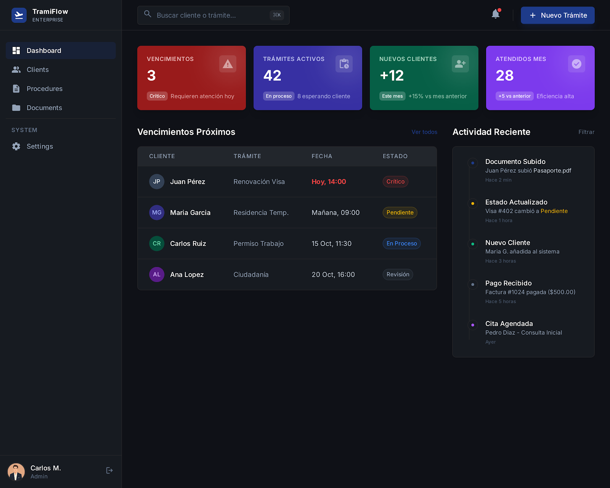
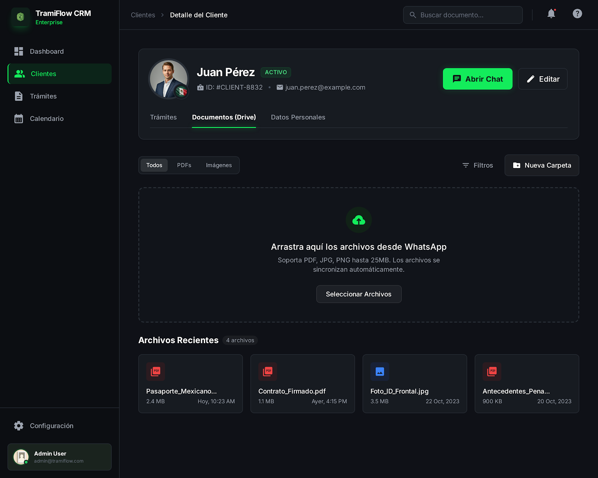
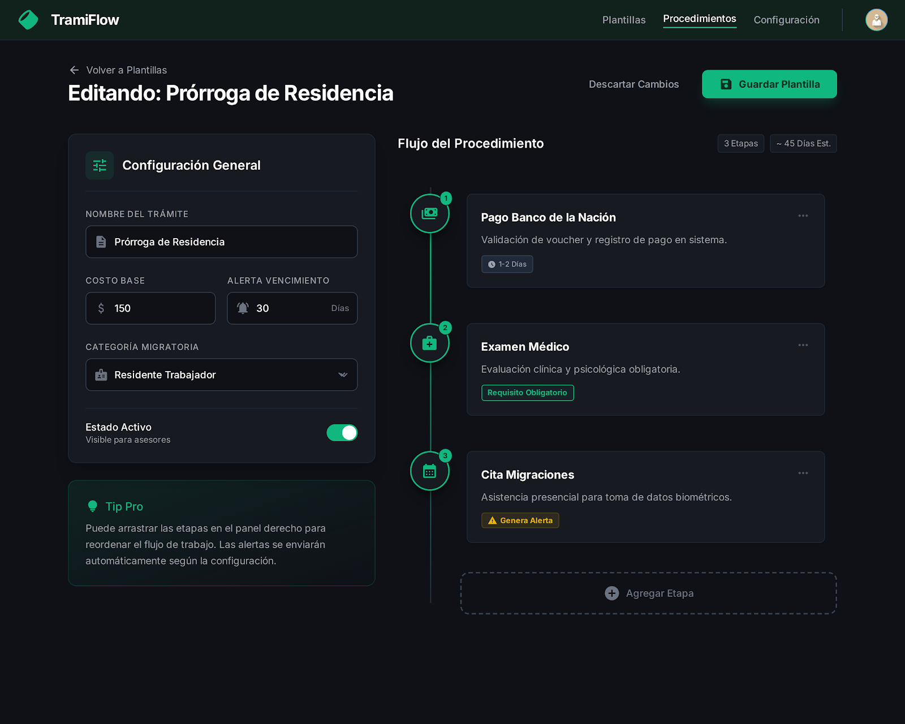
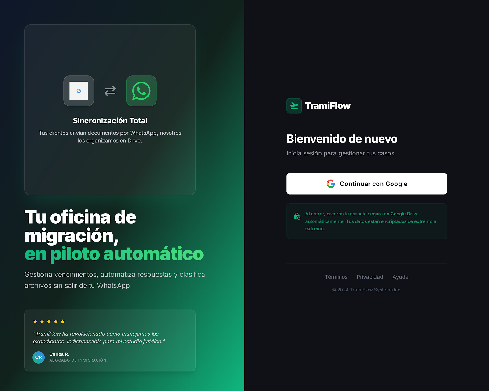
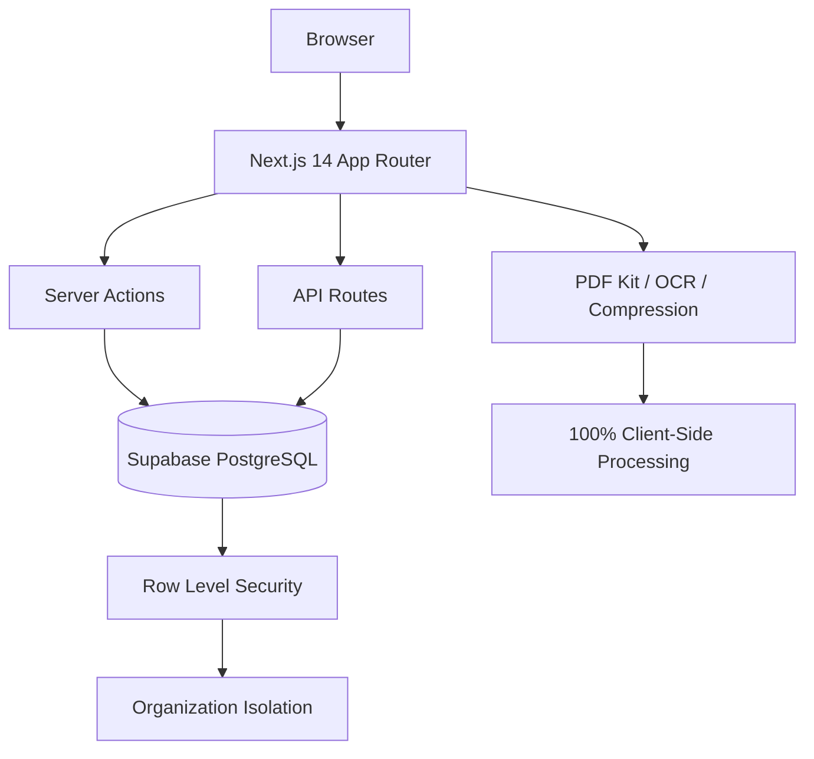

<div align="center">
  
  
  # TramiFlow CE
  
  **Open-source SaaS CRM for immigration procedure management**
  
  [Live Demo](https://tramiflow-demo.vercel.app) · [Documentation](./docs/README.md) · [Report Bug](../../issues) · [Request Feature](../../issues)
  
  
  
  
  
</div>

<br/>

## 📸 Screenshots

| Kanban & Procedures | Client Management |
| :---: | :---: |
|  |  |

| Procedure Template Builder | PDF Kit (Client-Side) |
| :---: | :---: |
|  |  |

---

## 🎯 What is TramiFlow?

TramiFlow is a flexible, multi-tenant SaaS CRM designed for law firms, consultants, and agencies. While originally conceived for immigration procedures, its dynamic engine allows professionals to manage **workflows and procedures of any kind** with ease, comfort, and strict order. It centralizes client management, procedure tracking (Kanban-based), document handling, and client-facing status pages — all with strict data isolation per organization.

Unlike generic CRMs, TramiFlow includes a **built-in PDF toolkit that runs 100% client-side** (no file uploads to the server for processing), and a visual Template Builder for reusable procedure workflows using a drag & drop interface.

---

## 💎 Core vs Pro

TramiFlow operates on an Open Core model. This repository contains the Community Edition.

| Feature | Community (Free) | Pro |
|---|---|---|
| Client management | ✅ Unlimited | ✅ |
| Kanban board (dynamic statuses) | ✅ | ✅ |
| Template builder | ✅ Basic | ✅ Advanced + Sharing |
| PDF Kit (6 tools, 100% client-side) | ✅ | ✅ |
| Smart Documents | ✅ Basic validation | ✅ Re-optimization |
| Public status page for clients | ✅ | ✅ |
| Analytics & Growth module | ❌ | ✅ |
| Smart Limits & subscription plans | ❌ | ✅ |
| Super Admin Panel (Command Vault) | ❌ | ✅ |
| Priority support | ❌ | ✅ |
| Self-hosting | ✅ | ✅ |
| Cloud hosted | ❌ | ✅ |

---

## 🛠 Tech Stack

| Layer | Technology |
|---|---|
| **Framework** | Next.js 14 (App Router) |
| **Language** | TypeScript 5 (strict mode) |
| **Database & Auth** | Supabase (PostgreSQL + RLS) |
| **UI** | Shadcn/UI + Tailwind CSS 4 |
| **State Management**| TanStack React Query |
| **Validation** | Zod + React Hook Form |
| **Drag & Drop** | `@dnd-kit` |
| **PDF Processing** | `browser-image-compression` + Canvas API (100% Client-Side) |
| **OCR** | Tesseract.js (Lazy loaded) |

---

## 🏗 Architecture



**Design Note:** TramiFlow uses a strict **Row Level Security (RLS)** multi-tenant architecture on a single PostgreSQL database rather than separate databases per tenant. Resource consumption and subscription limits (in the PRO version) are strictly intercepted at the **Server Actions** layer, ensuring the client state is never trusted.

---

## 🚀 Quick Start

### Prerequisites
- Node.js 18+
- A [Supabase](https://supabase.com) project (free tier works)

### Installation

```bash
git clone https://github.com/tu-usuario/tramiflow-ce.git
cd tramiflow-ce
npm install
cp .env.example .env.local
# Fill in your Supabase credentials in .env.local
npm run dev
```

Open [http://localhost:3000](http://localhost:3000).

📖 For full setup with Supabase migrations, see [LOCAL_SETUP.md](./LOCAL_SETUP.md).

---

## 🗺 Roadmap

- [x] Multi-tenant architecture with RLS
- [x] Dynamic Kanban with custom statuses
- [x] PDF Kit (compress, merge, OCR)
- [x] Smart Documents basic validation
- [ ] Email notifications (Resend integration)
- [ ] Mobile app (React Native / Expo)
- [ ] Webhook system for external integrations
- [ ] i18n support (PT-BR, EN)

---

## 🤝 Contributing

Contributions are welcome! Please read [CONTRIBUTING.md](./CONTRIBUTING.md) for:
- Branch naming convention
- Commit message format
- PR process and review criteria
- Security reporting guidelines

---

## 📄 License

TramiFlow Community Edition is licensed under [AGPL-3.0](./LICENSE).

**What this means:**
- ✅ Free to use, modify, and self-host
- ✅ Commercial use allowed (self-hosted)
- ⚠️ If you offer TramiFlow as a hosted service, you must open-source your modifications
- ❌ The Pro features are not covered by this license

For commercial licensing inquiries: carlos@tramiflow.com
